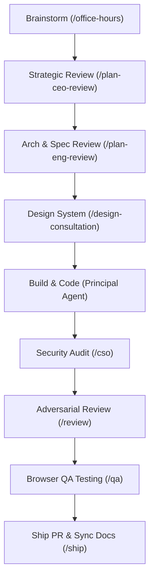

# 🔮 GStack Reference Guide
### *Your Virtual Engineering Team & Agentic Workflows*

Welcome to your offline team. **GStack** organizes AI-assisted development into a rigorous, role-based sprint cycle (**Think → Plan → Build → Review → Test → Ship → Reflect**). 

This guide is your quick reference for every slash command, standalone utility, and power tool available in GStack, along with the exact commands to run them.

---

## 🏛️ The Sprint Lifecycle

Every feature should follow this structured sequence to prevent bugs, avoid scope creep, and ensure complete, shippable code.



---

## 🛠️ Complete Slash Commands Directory

You can trigger any of these workflows directly in our chat by saying: **"Run [command] [context]"** or **"Let's do [command]"**.

### 1. Strategic Planning & Ideation (Think)
* **`/office-hours` (YC Office Hours):** 
  * *What it does:* The ultimate brainstorming tool. Interrogates your product idea using six YC-forcing questions (demand specificity, status quo, narrowest wedge). 
  * *Output:* Generates an independent product design document saved to `~/.gstack/projects/`.
* **`/plan-ceo-review` (CEO / Founder):**
  * *What it does:* Audits the scope of your design document before coding. Selects from four modes: *Expansion, Selective Expansion, Hold Scope, or Reduction* to optimize product-market fit.
* **`/plan-eng-review` (Engineering Manager):**
  * *What it does:* Locks down technical architecture, ASCII data-flow diagrams, async constraints, state machines, and testing matrices.
* **`/plan-design-review` (Senior UI/UX Designer):**
  * *What it does:* Evaluates planned screens, information hierarchy, and layout patterns, scoring each dimension 0-10 to catch AI slop early.

---

### 2. UI/UX Design Engineering (Design)
* **`/design-consultation` (Design Partner):**
  * *What it does:* Builds a complete, cohesive design system from scratch, proposing styling tokens and creative risks. Generates `DESIGN.md`.
* **`/design-shotgun` (Visual Explorer):**
  * *What it does:* Generates 4-6 visual mockup layout variants based on a prompt and opens a side-by-side comparison board in your browser. Allows you to give iterative feedback (*"more spacing," "dark mode"*) and remixes until approved.
* **`/design-html` (Design Engineer):**
  * *What it does:* Converts an approved mockup into framework-native, production-grade frontend code (React, TSX, Vue) using clean computed CSS layout layers with zero external dependencies.
* **`/design-review` (Designer-Who-Codes):**
  * *What it does:* Live visual audit of a running webpage or local dev server. Edits code immediately to fix visual misalignments, spacing, and sizing errors.

---

### 3. Deep Code Quality & Security (Review)
* **`/review` (Staff Engineer):**
  * *What it does:* Scans your branch diff for complex logical bugs, memory leaks, resource deadlocks, and race conditions that pass standard CI checks. Auto-fixes minor issues immediately.
* **`/investigate` (Autonomous Debugger):**
  * *What it does:* Systematic, hypothesis-driven debugging. Traces data flow and isolates root causes. *Rule: It will never attempt a code fix without proving the diagnosis first.*
* **`/cso` (Chief Security Officer):**
  * *What it does:* Runs an adversarial OWASP Top 10 + STRIDE threat model audit on your codebase. Outlines concrete exploit scripts and writes secure mitigation patches.

---

### 4. Interactive Browser QA (Test)
* **`/qa` (QA Lead):**
  * *What it does:* Drives a **real Chromium browser instance** on your screen/sandbox. Navigates to your staging URL or local dev server (e.g., `http://localhost:5173`), clicks through flows, submits test forms, finds errors, writes a regression test to prevent regression, and applies the code fix.
  * *How to invoke:* `"Run /qa http://localhost:5173"`
* **`/qa-only` (QA Reporter):**
  * *What it does:* Same browser-driven QA audit as `/qa`, but only outputs a clean, prioritized bug report without editing any source code.
* **`/setup-browser-cookies` (Auth Porter):**
  * *What it does:* Securely imports session cookies from your active Chrome/Arc/Brave browser into GStack's headless browser so you can test logged-in or behind-the-MFA user dashboards.

---

### 5. Smooth Deployment & Documentation (Ship)
* **`/ship` (Release Engineer):**
  * *What it does:* Syncs main, executes the full test suite, measures test coverage, auto-updates stale files (`README.md`, `CLAUDE.md`, docs) using `/document-release` to reflect code changes, pushes the branch, and opens a GitHub PR.
* **`/land-and-deploy` (Release Engineer):**
  * *What it does:* Merges the active PR, monitors the CI build, triggers production deployment, and runs a sanity check on the production endpoint.
* **`/canary` (SRE):**
  * *What it does:* Enters a monitoring loop on a newly deployed URL, watching for network latency spikes, unhandled console exceptions, or memory leaks.
* **`/benchmark` (Performance Engineer):**
  * *What it does:* Profiles page load speeds, bundle file sizes, and Core Web Vitals (LCP, INP, CLS) to flag performance regressions.
* **`/document-generate` (Technical Writer):**
  * *What it does:* Auto-generates missing documentation pages from scratch using the structured **Diataxis framework** (Reference, How-to, Tutorial, Explanation) by reading the codebase.

---

## ⚡ Power Tools & Standalone CLIs

GStack includes several powerful utilities that run directly from your terminal:

### 1. `gstack-model-benchmark` (Cross-Model Evaluator)
Stress test prompts or code changes across multiple LLM providers simultaneously to compare latency, tokens, cost, and output quality.
```bash
# Run a dry-run test to verify keys and configuration
gstack-model-benchmark --prompt "Optimise this database query" --dry-run

# Run a live benchmark across Claude, GPT-4o, and Gemini
gstack-model-benchmark --prompt "Draft a secure auth middleware" --output benchmark_results.md
```

### 2. Multi-Agent Pairing (`/pair-agent`)
Share a GStack headed Chromium browser with a completely different agent (Cursor, Codex, or Hermes) so they can collaborate on the same page.
```bash
# Start a secure pairing bridge in a headed browser
/pair-agent
```

### 3. Persistent Knowledge Memory (`gbrain`)
Keep your AI agent's learnings, code patterns, and constraints warm across completely different terminal sessions and folders.
```bash
# Zero-config setup to initialize a local PGLite or cloud Supabase brain
/setup-gbrain

# Semantic-index your active codebase repository into your brain
/sync-gbrain --full
```

### 4. Sandbox Safeguards (`/guard`)
Protect your production database and master history from destructive AI commands.
* **`/freeze [dir]`:** Locks the AI's file-write operations strictly to the specified subdirectory.
* **`/careful`:** Emits prompt warnings before executing destructive commands (e.g., `rm -rf`, `DROP TABLE`, `force-push`).
* **`/guard`:** Activates both `/freeze` and `/careful` in one command.
* **`/unfreeze`:** Removes all directory restrictions.

---

## 📂 Key Directories on Your Machine

* 📂 **`~/.claude/skills/gstack/`**: The core cloned GStack repository.
* 📂 **`~/.claude/skills/`**: The active slash commands linked to Claude Code.
* 📂 **`~/.gstack/`**: Global GStack state folder. Contains your persistent developer profile (`developer-profile.json`), local analytics, and chronological timelines.
* 📂 **`~/.gstack/projects/Mohnish8717-tsc-archite/`**: Project-specific storage containing all your office-hours design documents, plans, and learnings.
